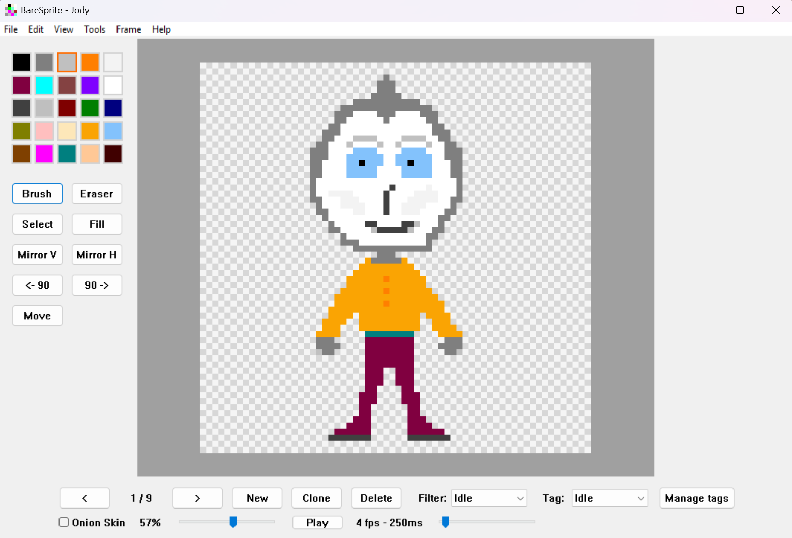
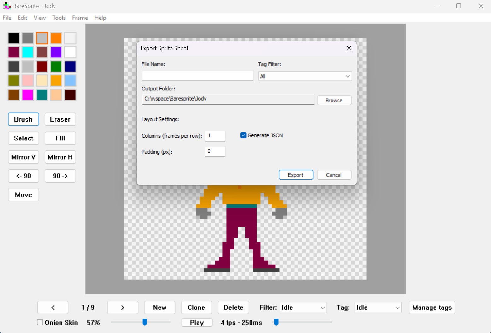
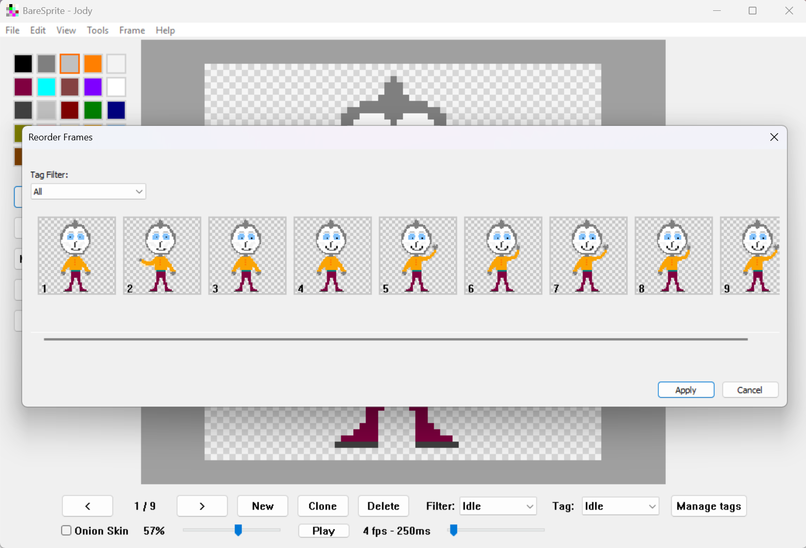

# BareSprite

**BareSprite** is a minimalist, native pixel art editor for Windows. Built with pure C++ and Win32 API, it delivers a fast, lightweight, and dependency-free experience for sprite animation and editing.

## 🚀 Features

*   **⚡ Lightning Fast:** Instant startup. No waiting for heavy frameworks to load.
*   **🧱 Zero Dependencies:** A single **764 KB** `.exe` file. No installation, no VC++ Redist required, no .NET runtime. Just download and run.
*   **🎨 Full Animation Support:** Frame-by-frame editing, onion skinning, and playback controls.
*   **📦 Export Formats:** Export your work as **PNG** (spritesheet or frames) or **GIF** animation.
*   **🛠 Native Win32 UI:** Custom dialogs, smooth scrolling, and professional resource management.
*   **🖱 Custom Cursor:** High-precision crosshair cursor for pixel-perfect drawing.

## 📸 Screenshots

### Main Interface

### Export Options

### Reorder Frames

## 📦 Installation

BareSprite is portable. No installation is required.

1.  Download the latest release (`baresprite_v1.0.zip`).
2.  Extract the archive to any folder.
3.  Run `baresprite.exe`.

## ⌨️ Controls & Shortcuts

| Action | Shortcut |
| :--- | :--- |
| **Play / Pause Animation** | `Space` |
| **Previous / Next Frame** | `Left` / `Right` Arrow |
| **Save Project** | `Ctrl + S` |
| **Undo / Redo** | `Ctrl + Z` / `Ctrl + Y` |
| **Zoom In / Out** | `Ctrl + Mouse Wheel` |
| **Brush Tool** | `B` |
| **Eraser Tool** | `E` |
| **Select Tool** | `S` |
| **Fill Tool** | `F` |

## 🛠 Tech Stack

BareSprite is built using:
*   **Language:** C++ (C++17)
*   **Platform:** Native Windows (Win32 API, GDI)
*   **Resource Compilation:** MSVC Resource Compiler

##  Third-Party Libraries

This project utilizes the following header-only libraries for image processing:

*   **[stb_image_write.h](https://github.com/nothings/stb)** by Sean Barrett — Used for PNG export. *(Public Domain / MIT)*
*   **[gif.h](https://github.com/charlietangora/gif-h)** by Charlie Tangora — Used for GIF encoding. *(Unlicense)*

Both libraries are statically compiled into the executable, ensuring zero external runtime dependencies.

## 📝 License

This project is licensed under the **MIT License** - see the [LICENSE](LICENSE) file for details.

---

**Copyright © 2026 Egor Lentarev.**