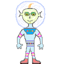
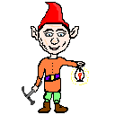
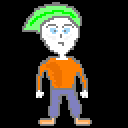
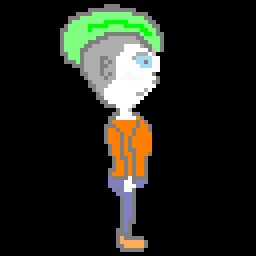
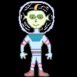
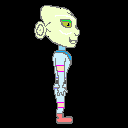
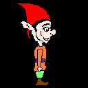

# BareSprite

**BareSprite** is a minimalist, native pixel art editor for Windows. Built with pure C++ and Win32 API, it delivers a fast, lightweight, and dependency-free experience for sprite animation and editing.

## 🚀 Features

*   **⚡ Lightning Fast:** Instant startup. No waiting for heavy frameworks to load.
*   **🧱 Zero Dependencies:** A single **760 KB** `.exe` file. No installation, no VC++ Redist required, no .NET runtime. Just download and run.
*   **🎨 Full Animation Support:** Frame-by-frame editing, onion skinning, and playback controls.
*   **📦 Export Formats:** Export your work as **PNG** (spritesheet or frames) or **GIF** animation.
*   **🛠 Native Win32 UI:** Custom dialogs, smooth scrolling, and professional resource management.
*   **🖱 Custom Cursor:** High-precision crosshair cursor for pixel-perfect drawing.

## Demo

## Animation

*A simple pixel art editor in action*

## 📸 Screenshots

### Main Interface

### Export Options

### Reorder Frames

## 📦 Installation

BareSprite is portable. No installation is required.

1.  Download the latest release (`baresprite_v1.0.7.zip`).
2.  Extract the archive to any folder.
3.  Run `baresprite.exe`.

## ⌨️ Controls & Shortcuts

| Action | Shortcut |
| :--- | :--- |
| **Play / Pause Animation** | `Space` |
| **Previous / Next Frame** | `Left` / `Right` Arrow |
| **Save Project** | `Ctrl + S` |
| **Undo / Redo** | `Ctrl + Z` / `Ctrl + Y` |
| **Cut / Copy / Paste** | `Ctrl + X` / `Ctrl + C` / ` Ctrl + V` |
| **Zoom In / Out** | `Ctrl + Mouse Wheel or Ctrl + - & Ctrl + =` |
| **Brush Tool** | `B` |
| **Eraser Tool** | `E` |
| **Select Tool** | `S` |
| **Fill Tool** | `F` |

## 🛠 Tech Stack

BareSprite is built using:
*   **Language:** C++ (C++17)
*   **Platform:** Native Windows (Win32 API, GDI)
*   **Resource Compilation:** MSVC Resource Compiler

## 🤝 Contributing

BareSprite is currently developed as a **single-author project**. 

**I appreciate your interest**, but I'm not accepting code contributions (Pull Requests) at this time to maintain a consistent architecture and vision.

**However, you can still help:**
- 🐛 Report bugs via [Issues](https://github.com/lentarev/baresprite/issues)
- 💡 Suggest features via [Issues](https://github.com/lentarev/baresprite/issues)
- ⭐ Star the repo to support development

Your feedback is invaluable — just not in the form of code (for now). Thank you for understanding! ❤️

## 📚 Third-Party Libraries

This project utilizes the following third-party libraries:

### Header-Only
- **stb_image_write.h** by Sean Barrett — Used for PNG export.  
  License: Public Domain / MIT  
  Source: https://github.com/nothings/stb

### Compiled Library (Static Linking)
- **giflib** by Eric S. Raymond et al. — Used for GIF encoding with global palette support.  
  License: MIT License  
  Source: https://giflib.sourceforge.net/

Both libraries are statically compiled into the executable, ensuring zero external runtime dependencies.

## 📝 License

This project is licensed under the **MIT License** - see the [LICENSE](LICENSE) file for details.

> Full license texts for third-party libraries (giflib, stb_image_write) are included in [THIRD_PARTY_LICENSES.txt](THIRD_PARTY_LICENSES.txt).

---

**Copyright © 2026 Egor Lentarev.**